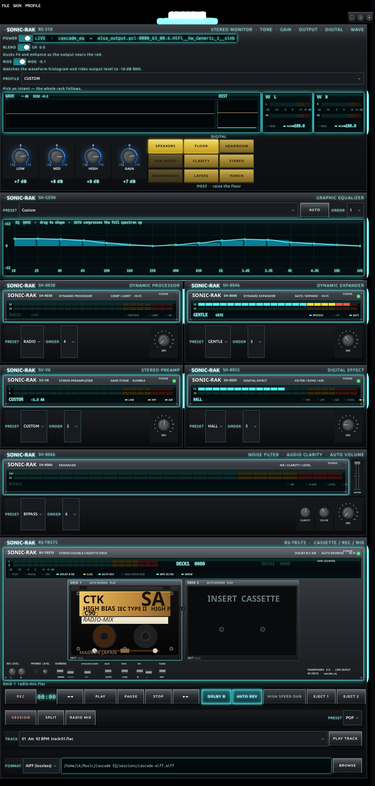

# Audioscapes

Hear more of every song on Linux. Audioscapes is a **SONIC-RAK** vintage audio rack that sits between your apps and your speakers, headphones, or USB interface and shapes the whole mix — not just one player.

It equalizes, compresses, and lifts buried low, mid, and high so thin tracks fill out. You get a 16-band graphic EQ with a live analyzer and AUTO, a 3-band tone stack, dynamics, FX, output routing, and a cassette-style deck for recording and radio mixes. Closing the panel does not stop processing.

The engine is **Cascade EQ** on PipeWire, using **LSP** plugins (the same DSP family Easy Effects uses): Graphic Equalizer x16 Stereo, Compressor Stereo, and Limiter Stereo. The control panel is a native GTK4 / libadwaita SONIC-RAK app.



## Download

Ubuntu 24.04 (or similar). Get the latest zip from **[Releases](https://github.com/advancedresearcharray/audioscapes/releases/latest)**, unzip it, then:

```bash
cd audioscapes-*
sudo apt install pipewire pipewire-pulse wireplumber lsp-plugins-lv2 \
  gstreamer1.0-plugins-bad gstreamer1.0-pipewire python3-gi gir1.2-gtk-4.0 gir1.2-adw-1
./install.sh
cascade-eq gui
cascade-eq enable
```

That link always points at the newest build. You can also clone the repo if you prefer git.

## Requirements (Ubuntu 24.04)

These are typically already present if you use Easy Effects or GNOME:

- `pipewire` `pipewire-pulse` `wireplumber`
- `lsp-plugins-lv2`
- `gstreamer1.0-plugins-bad` (LV2 wrapper)
- `gstreamer1.0-pipewire`
- `python3-gi` `gir1.2-gtk-4.0` `gir1.2-adw-1`

```bash
sudo apt install pipewire pipewire-pulse wireplumber lsp-plugins-lv2 \
  gstreamer1.0-plugins-bad gstreamer1.0-pipewire python3-gi gir1.2-gtk-4.0 gir1.2-adw-1
```

## Install

If you downloaded a release zip, use the **Download** steps above. From a git checkout:

```bash
cd /path/to/audioscapes
./install.sh
cascade-eq gui
```

## Use

```bash
cascade-eq enable
cascade-eq preset load "Bass Boost"
cascade-eq set --band 1k=3 --band 63=-2 --preamp -1
cascade-eq eq auto
cascade-eq profile load "Remaster"
cascade-eq profile list
cascade-eq compressor --on --threshold -18 --ratio 4 --mode rms
cascade-eq blend --on --threshold -8
cascade-eq ride --on --target -18
cascade-eq limiter --on --ceiling -1 --lookahead 5
cascade-eq status
cascade-eq disable
```

Every subcommand supports `--help` with examples. `--dry-run` prints the plan without touching the audio graph.

`enable` creates a virtual sink named `cascade_eq`, points it at your current hardware output (speakers, headphones, Bluetooth), and makes it the default device so every app is processed.

The processed mix can be recorded to lossless (FLAC, WAV, WavPack, AIFF) or lossy (MP3, Ogg Vorbis, Opus, AAC) files. Model **370** is the SONIC-RAK dual cassette deck and plays files (including `radio-mix.flac`) through the `cascade_eq` sink so they run the same EQ as system audio. Use EJECT 1 / EJECT 2 to load wells, or RADIO MIX to seat the last mix in the selected deck. **HIGH SPEED DUB** plays the source well at 2× through the rack, records it, restores a 1× tape, and loads the other well. With **DOLBY B** off, cassette playback uses tape color (high-end roll-off and wow). The graphic EQ shows a live 16-band RTA; **AUTO** stays on and listens every 4 beats, then flattens loud bands. Press AUTO again to stop. Cassette tracks use their analyzed BPM; otherwise the live tempo guess is used.

**Profiles** set the whole rack for one intent (EQ, dynamics, expander, preamp, FX, and enhance together). On the 310 monitor unit pick **PROFILE**, or:

```bash
cascade-eq profile list
cascade-eq profile load "Add Headroom"
cascade-eq profile load remaster
```

Profiles include Add Headroom, Improve Quality, Bass Infused, Brighter, Warmer, Remaster, Louder, Night Listen, Voice, Wider, Punch, Restore, Cinema, and Translate.

**Blend** is a background compressor on the 310 monitor. It watches output peak and ducks FX / enhance wet mix (crush/chop harder than echo) as the signal nears the red, blending dry back in so stacked chains do not fry. Default on. Toggle **BLEND** next to POWER, or:

```bash
cascade-eq blend --on --threshold -8 --ratio 5
cascade-eq blend --off
```

**Wave / Ride** on the 310 shows a live output waveform and amplitude histogram of what is playing. With **RIDE** on, the app watches that form and rides makeup so RMS sits near **-18 dB**, boosting quiet material and cutting back before the ceiling. Silence is gated; peaks cannot ride into the red. **GAIN** on the 310 is master volume (−12 to +12 dB). **LOW / MID / HIGH** are a 3-band tone stack on the same unit (bass shelf, 1 kHz mid, treble shelf). Tone and master stay put when you change profiles. Next to GAIN, **SPEAKERS / USB AUDIO / HEADPHONES** pick where the mix goes; the lit yellow key is the live output. To the right, **DIGITAL** is a post-stage effect: FLOOR, HEADROOM, CLARITY, STEREO, LAYERS, PUNCH. Press again to bypass. It sits after tone and does not change the 350 FX rack.

```bash
cascade-eq ride --on --target -18
cascade-eq ride --off
cascade-eq set --master 6
cascade-eq set --low 3 --mid 0 --high 2
cascade-eq output speakers
cascade-eq output headphones
cascade-eq digital floor
cascade-eq digital clarity
cascade-eq digital --off
```

Record a **session** of multiple songs with silence between them, then split tracks and radio-mix. After **SPLIT**, the 370 cassette deck lists those songs in **TRACK**; **PLAY TRACK** previews the selected cut through the rack. Default **pop** mix opens on the lowest-energy song, climbs sequential root keys, and throws an **8-count echo** of the incoming track before that song starts. Internal audio stays 32-bit float and the mix is written as **24-bit FLAC**. Levels are peak-matched once; the mix is never pumped up to a loud median. **House** is the long 32-count DJ blend in compatible key and energy order.

```bash
cascade-eq record formats
cascade-eq record start --format flac
cascade-eq record stop
cascade-eq session split --input ~/Music/show.flac
cascade-eq session mix --input ~/Music/show.flac
```

`ffmpeg` is used for silence detection, time-stretch, and pitch (Ubuntu’s `ffmpeg` includes rubberband).

If Easy Effects is also capturing the default output, disable Easy Effects output processing so the two graphs are not stacked.

## Presets

Flat, Bass Boost, Bass Reduce, Treble Boost, V-Shape, Vocal, Podcast, Night, Laptop Speakers, Headphones, Rock, Electronic, Classical, Jazz, Acoustic, Movie, Loudness, Warm, Bright, Bluetooth Safe.
